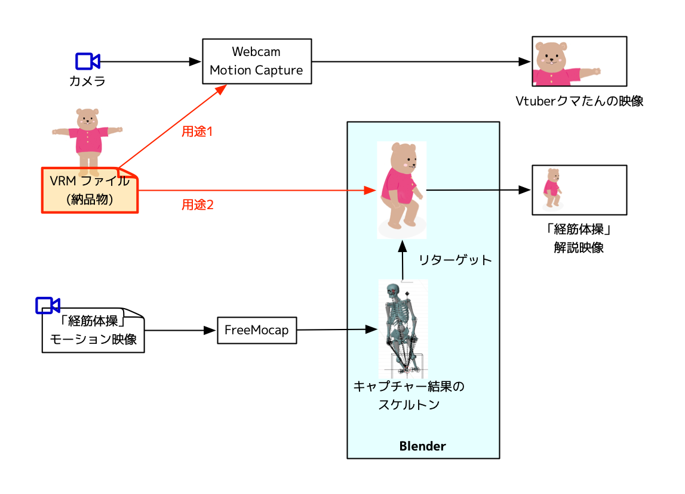
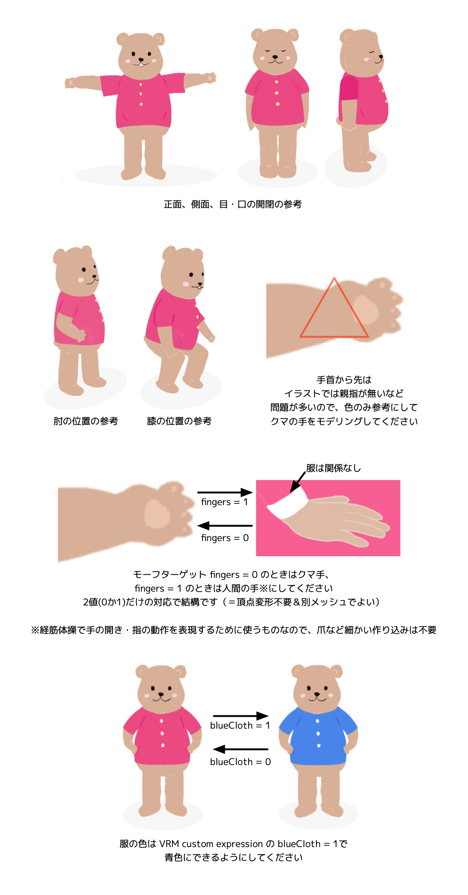

# 3Dクマたんモデル制作仕様書

## 概要

シャンティ・フーラのオリジナルキャラクター「クマたん」の3Dモデルを制作し、VRM 1.0準拠のスケルトンにスキニングし、VRMファイルを納品してください。

## 納品物及びチェックポイント

- 納品物: VRM 1.0ファイル
- スキニング工程前に3DモデルデータをチェックしたいのでFBX/glb形式等でお送りください

## 目的・用途

- 用途1）[Webcam Motion Capture](https://webcammotioncapture.info/)に納品VRMを読み込ませ、クマたんのVTuber映像を制作します
- 用途2）[FreeMoCap](https://freemocap.org/)を用いて[経筋体操](https://shanti-phula.net/ja/smg/keikin-taisou)のモーションキャプチャーを行い、結果をBlender上で納品VRMのリグにリターゲットして、経筋体操の解説映像を制作します

## イラストイメージ

## VRMの仕様

- 揺れ物はありません
- メタデータ
    - 名前(name): `Shanti Phula Kumatan`
    - 作者(authors): `Shanti Phula LLC`
    - その他の項目はデフォルト
- ヒューマノイドボーン
    - [VRM 1.0 humanoid仕様](https://github.com/vrm-c/vrm-specification/blob/master/specification/VRMC_vrm-1.0/humanoid.ja.md)に定義されたボーンは、「必須」列の有無にかかわらずすべて必要です
        - 指のボーンは人間の手（後述 fingers 参照）の状態で正常に動くようにしてください
        - 明らかに無意味なボーンがあればお知らせください
- 表情(Expressions)
    - [VRM 1.0 expressions仕様](https://github.com/vrm-c/vrm-specification/blob/master/specification/VRMC_vrm-1.0/expressions.ja.md)の定義に基づき
        - プリセット「感情」：すべてサポートしてください
        - プリセット「リップシンク」：すべてサポートしてください
        - プリセット「瞬き」：すべてサポートしてください
        - プリセット「視線」：不要（視線はボーン制御で行う）
        - カスタムエクスプレッション
            - `fingers`: 0でクマ手、1で人間の手（イラストイメージ参照）
            - `blueCloth`: 0で赤い服、1で青い服（イラストイメージ参照）

## 著作権と利用条件

- 成果物に関する著作権はすべて弊社に帰属し、制作者は当該成果物に関し著作者人格権を行使しないものとします。
- ただしイメージイラストと制作者がモデルを用いて作った画像・映像（NSFW利用は禁止）を、制作実績・作例として掲載いただけます。

以上
